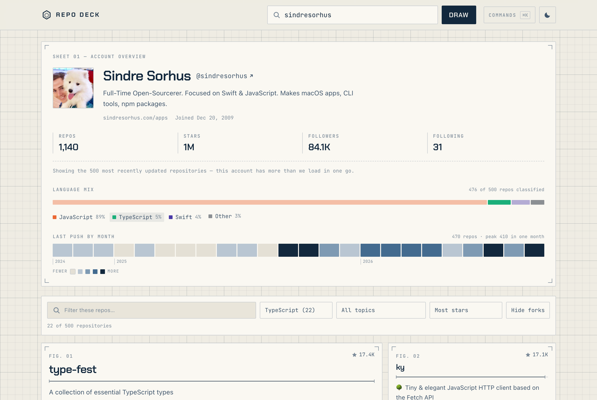

# RepoBox

A GitHub repository explorer drawn as a technical document. Enter a username, get their public
repos — sortable, filterable, and weighed by the languages they actually build in.

**Live demo: https://rishi-gandhi.github.io/SASE-SWEET-Take-Home-Project/**


---

## Running it

```bash
npm install
npm run dev          # http://localhost:5173
```

Other scripts:

```bash
npm run build        # production bundle into dist/
npm run preview      # serve the built bundle
npm test             # 78 unit + integration tests
npm run typecheck    # tsc, no emit
```

No API key, no `.env`, no backend. It talks straight to the public GitHub REST API.

**Stack:** React 19 + TypeScript + Vite, Tailwind CSS v4, Vitest + Testing Library. Two webfonts
(Chakra Petch, JetBrains Mono) from Google Fonts. No component library — see
[Why no component library](#why-no-component-library).

---

## What it does

- Look up any GitHub user and browse their public repositories
- Sort by stars, recency, name, or forks — and watch the cards physically travel to their new
  positions rather than teleport
- Filter by free text (name, description, **and** topics), by language, by topic, or by fork status
- **Compare two accounts** side by side, with their repositories merged into one sortable grid
- A **language mix** bar and a **last-push activity strip** summarising the whole account
- A **command palette** (`⌘K`) for jumping to a user, opening a repo, pinning, or comparing
- **Pin** accounts you return to; recents are remembered automatically
- A **live API budget meter**, read from the response headers
- A **condensed header** that keeps the account and its language mix on screen as you scroll
- Loading, empty, no-match, and four distinct error states
- Light/dark themes, keyboard shortcuts, and a layout verified from 320px up
- Every view is a shareable URL


| Command palette | Light theme ("blueline print") |
|---|---|
|  |  |

---

## Design decisions

### The drawing

The app is a technical drawing: a measurement grid, registration marks at each sheet's corners,
figure numbers on every repository, dimension lines instead of progress bars, and drafting
annotations set in mono. Dark mode is a cyanotype blueprint — pale lines on drafting blue. Light
mode is a blueline print — navy ink on paper. They are the same drawing, not two themes.

The metaphor was chosen because it is *earned*: the app's actual job is reading the structure of
someone's work. It also protects the colour system below, because annotated measurement is the
aesthetic rather than something applied on top of it.

### The colour system, and the one collision that shaped it

Every colour is validated for colour-vision deficiency against the two surfaces the app actually
renders on. Colours are only safe together if **every pair** stays distinguishable — measured as
perceptual distance in OKLab, with thresholds of ΔE ≥ 8 under simulated CVD and ≥ 15 for normal
vision. Three roles, and the separation between them is the whole system:

| Role | What it is | Why |
|---|---|---|
| **Data** | 3 language hues — orange, aqua, violet | The largest set that clears the all-pairs gate in **both** modes (worst CVD ΔE 9.4 dark / 9.2 light; worst normal-vision ΔE 24.6 / 27.6). A fourth named hue cannot, so the tail folds into neutral grey. |
| **Chrome** | grid, rules, annotations | Deliberately **below** the chroma floor (0.067 against a floor of 0.1) so it reads as structure and can never be mistaken for a data series. |
| **Accent** | interaction, focus, magnitude | Achromatic on purpose (chroma 0.018 / 0.048) so it collides with nothing. |

That last row is the interesting one. The obvious accent for a blueprint is cyan — and cyan
**failed**. It measures ΔE 12.4 from the violet language hue in dark mode and 10.1 in light, both
under the 15 floor, meaning a viewer with full colour vision could confuse a UI accent with a
language. So cyan was demoted to recessive chrome and the accent became paper-white on dark, ink-navy
on light. Which, conveniently, is what a real blueprint does anyway.

The measurements are in the comment block at the top of [`src/styles.css`](src/styles.css).

### No auth token, and an honest rate limit

The app calls GitHub unauthenticated: **60 requests/hour, per IP**. Shipping a token in a public
client-side app would leak it, and proxying through a backend was out of scope.

So instead of hiding the limit, the app puts it on screen. A meter in the footer reads
`x-ratelimit-remaining` and `x-ratelimit-limit` off **every** response — successes and failures
alike — and turns amber, then red, as the budget runs down.

Detecting an exhausted quota takes more than a status code: GitHub answers with `403`, the same
status it uses for genuinely forbidden requests. The header `x-ratelimit-remaining: 0` is what
actually distinguishes them. When the app sees that, it reads `x-ratelimit-reset` and says when the
quota refills.

Three things keep the app under the limit in normal use:

- **Client-side filtering.** All of a user's repos are fetched once, then every search, sort, and
  filter runs in memory. Typing costs zero requests. GitHub's search endpoint would be the
  alternative, and it is both slower and capped at 10 requests/minute anonymous.
- **An in-memory profile cache.** Revisiting a user (including via browser Back) costs nothing.
- **Local username validation.** A handle GitHub's own rules would reject never leaves the browser.

### Pagination has a deliberate ceiling

`/users/:login/repos` returns 100 per page. The app follows pages until a short page comes back, but
stops at **5 pages / 500 repos**. An uncapped loop over a 3,000-repo org would burn the entire hourly
budget on one search. It fetches sorted by `updated`, so anything dropped is the least recently
touched, and the UI says so rather than silently showing a partial list.

### Cancelling in-flight requests

Searching a new user aborts the previous request via `AbortController`. Without it, a slow response
for `tor` can land *after* a fast one for `torvalds` and overwrite it — the classic async race in
search UIs. Aborts are re-thrown untouched so the error handler can tell "cancelled" from "failed".

### The URL is the state

User, search text, language, topic, sort, and the fork toggle all live in the query string:

```
?u=simonw&q=cli&lang=Python&topic=datasette&sort=updated
```

A view is shareable and survives a refresh. Looking up a new user **pushes** a history entry, so
browser Back moves between users; changing a filter only **replaces** it, so Back isn't fifteen
presses of undoing your own typing. Using the query string rather than path segments also means it
works on GitHub Pages with no SPA redirect hack.

### Animated re-sort (FLIP)

Changing the sort animates every card to its new position. The technique is FLIP — First, Last,
Invert, Play: React has already moved the cards by the time the layout effect runs, so each card's
new box is compared against the one recorded on the previous commit, the inverse translation is
applied, and then animated away. The browser only ever animates a `transform`, so a hundred cards
reorder on the compositor without a single layout pass.

Two details that are easy to get wrong:

- Positions are measured **relative to the container**, not the viewport. Viewport coordinates shift
  when the page scrolls between commits, which would make every card animate from the wrong place.
- A card whose **size** changed is skipped. That only happens when a repo becomes, or stops being,
  the principal — translating it would just smear the resize.

### The language mix: a bar, three colours

Part-to-whole, so it's a horizontal stacked bar rather than a donut: people are bad at comparing
angles and worse at arc lengths, and language names are long enough that a bar labels far better. It
doubles as a filter, which is why each segment is a real `<button>`.

**One caveat I'll own:** segment colours are assigned by rank, which is normally an anti-pattern —
recolouring a chart when you filter it misleads anyone who already learned "orange = Python". It's
safe here only because the spectrum is always computed from the **unfiltered** repo set. It's a fixed
portrait of the account; filtering the list below never repaints it.

### The activity strip is scaled by quartiles, not linearly

Each cell is one month, shaded by how many repositories were **last pushed** in it. It is
deliberately not called a contribution graph: the repos endpoint returns one timestamp per repo, not
a commit history, and pretending otherwise would be a lie dressed as a chart.

Levels are quartiles of the non-zero months, the way GitHub's own contribution graph scales. A linear
scale against the maximum looked correct and was useless: one bulk month of 400 dependency bumps
dragged every other month down to the same bottom step and the chart stopped saying anything.

### Comparing two accounts

Add a second handle and both accounts' repositories merge into one grid, each card tagged with its
owner. Every pure function — filtering, sorting, topic and language options — works on the merged
set unchanged, because GitHub ids are unique site-wide so the merge needs no deduplication.

The comparison itself is **one dumbbell per metric, each scaled to its own larger value**. That is
the important decision: repos and stars differ by three orders of magnitude, and putting them on one
shared axis would invent a relationship that is not in the data. Per-row scales are small multiples —
every row is its own chart — and the exact figures are printed in each row header rather than beside
the marks, so two close values can never overlap.

The two accounts are distinguished by **two shades of one hue**, not two hues. Lightness is the only
channel every form of colour-vision deficiency preserves, so a light/dark pair is the most robust
two-series encoding available — and both are labelled regardless.

Comparing costs twice the API budget, which is why the profile cache matters: flipping between two
accounts you have already loaded is free.

**One invariant worth stating**, because it is subtle and I got it wrong first: language colours are
keyed to the *primary* account's mix and nothing else. I initially keyed them to the merged pool,
which meant starting a comparison **repainted** languages already on screen — C went from orange to
grey because a 500-repo Python account outvoted it. That is the recolour-on-filter anti-pattern, and
there is now a regression test for it. Repos in a language outside the primary account's top three
get the neutral, which while comparing is itself informative: coloured means "a language this account
actually works in".

### The bento lead cell

The lead card in the current ordering gets a double-width cell, a larger figure, and a spec block —
licence, open issues, watchers, homepage. All of that is already in the payload and was previously
discarded. Thirty identical boxes have no reading order; one lead does.

### The condensed header

Once the profile sheet scrolls out of view, a slim bar takes its place carrying the avatar, handle,
visible repo count, and a miniature of the language mix — so the account's shape stays on screen
while you read its repositories.

It uses an `IntersectionObserver` rather than a scroll listener: no per-frame work, no reading layout
on every scroll event. Two details: the observer only counts scrolling *past* the sheet (an element
below the fold is also "not intersecting" and must not trigger the bar), and the observed node is
held in **state, not a ref** — it only mounts once a profile loads, and an effect keyed on a ref
object would have run once against `null` and never again. That bug shipped in my first attempt and
the bar simply never appeared.

### Staggered entrance

Cards arrive on a 22ms cascade, capped at fourteen so a 500-repo account does not spend twelve
seconds drawing itself in. The delay is a CSS custom property set per card; under
`prefers-reduced-motion` both the duration *and the delay* are zeroed — zeroing only the duration
would leave late cards parked at `opacity: 0` for their full delay.

The entrance animation lives on the card and the FLIP transform lives on the grid item, so the two
transforms are on different elements and can never fight.

### Four error states, not one

"Something went wrong" is useless — a typo'd username, an exhausted quota, and a dropped connection
need three different actions. The API layer classifies failures into
`not-found | rate-limit | network | invalid-username | unknown`, and the UI writes real copy for each,
including whether a retry button even makes sense (it doesn't for a 404).

Empty is split too: **"this account has no public repos"** and **"your filters matched nothing"** are
different problems, and only the second one gets a "clear filters" button.

### Why no component library

The brief said component libraries were fine, but the same brief said the evaluation is about
technical decisions I can explain. Pulling in Mantine or shadcn would have meant a chunk of the UI
was code I hadn't written. The interactive pieces here are small enough to own: the dropdowns are
**native `<select>`**, which is keyboard- and screen-reader-correct for free and opens the platform
picker on a phone.

Tailwind v4 does the layout and the design tokens. Every colour is a CSS custom property defined once
and swapped for dark mode in one place, which is what makes the theme toggle a single attribute on
`<html>`.

### Accessibility

A skip link, one consistent focus-visible treatment, `aria-pressed` on every toggle, a polite live
region announcing the result count, labelled controls throughout, `prefers-reduced-motion` honoured
(the FLIP animation simply doesn't run), and a theme applied before first paint so light-mode users
never get flashed.

The command palette is a listbox driven by the input rather than a set of focusable rows, so the
caret never leaves the field — `aria-activedescendant` is what tells a screen reader which option is
current. It traps scroll, closes on Escape, and restores focus to whatever opened it.

Repo cards use a stretched-link pattern — the whole card is clickable, but the accessibility tree
sees exactly one link, with the language and topic chips lifted above it so they stay independently
clickable.

---

## Architecture

```
src/
  lib/
    github.ts      API client, pagination, error taxonomy
    repos.ts       filter + sort + topic/language options (pure)
    spectrum.ts    language distribution (pure)
    activity.ts    last-push histogram + quartile scaling (pure)
    compare.ts     two-account metrics, shared languages/topics (pure)
    rateLimit.ts   quota store, written by the client, read via useSyncExternalStore
    format.ts      numbers, relative dates (Intl)
  hooks/
    useProfile.ts      fetch state machine, abort, cache
    useDeckState.ts    URL <-> state
    useFlipReorder.ts  FLIP reorder animation
    useScrolledPast.ts IntersectionObserver for the condensed header
    useRecentUsers.ts  recent handles (localStorage)
    usePinnedUsers.ts  pinned handles (localStorage)
    useRateLimit.ts    subscribes to the quota store
    useTheme.ts        theme persistence
  components/     presentational; no fetching
  test/
```

The split that matters: **anything with interesting logic is a pure function in `lib/`.** Sorting,
filtering, the language breakdown, and the activity histogram take data in and return data out, so
they're testable without rendering anything. Components receive props and render. Hooks own the messy
parts — network, URL, storage, animation.

State is `useState` + `useMemo`. No Redux, no React Query, no router. The one exception is the rate
limit, which lives in a module-level store because the API client writes to it and the client has no
business importing a hook — `useSyncExternalStore` is the supported way to read that without tearing.

## Tests

78 tests, run with `npm test`:

- **`repos.test.ts`** — every sort key, tie-breaking, search across name/description/topics, language
  and topic filters, combinations, and that sorting doesn't mutate its input
- **`spectrum.test.ts`** — ranking, the three-colour cap, the "Other" fold, deterministic tie-breaks
- **`activity.test.ts`** — window boundaries, bucketing, and specifically that a 200-repo outlier
  month doesn't flatten the quiet months to one level
- **`compare.test.ts`** — per-metric scaling, no divide-by-zero on empty accounts, shared
  language/topic detection, and that merged ids stay unique
- **`rateLimit.test.ts`** — header parsing, malformed values, subscriber notification, and that an
  out-of-order response can't walk the remaining count back up
- **`github.test.ts`** — username validation, and that each failure maps to the right error kind:
  404, rate-limit-with-reset, a plain 403 that is *not* a rate limit, network failure, and an abort
  passing through untouched
- **`App.test.tsx`** — the real flows against a stubbed API: search → render, filter → count, topic
  chips, the command palette (open, run, Escape), the bento lead cell, the budget meter, URL
  round-tripping, each error state, comparing two accounts, a failed second account degrading
  without taking the first down, pinning surviving a remount, the stagger delays, and that starting
  a comparison does not repaint existing language colours

Two jsdom notes, in `src/test/setup.ts`: `scrollIntoView` is stubbed because it's universal in real
browsers and absent from jsdom. `matchMedia` and the Web Animations API are stubbed too, but the FLIP
hook *also* guards them — those two genuinely were missing from Safari within living memory.

## Trade-offs, and what I'd do next

- **The 500-repo ceiling.** Fine for people, visible for large orgs. Real fix is windowed infinite
  scroll, which is more machinery than this exercise warranted.
- **Total stars is a lower bound** for accounts past the ceiling, since it sums only what was loaded.
- **Star-bar scale is per-view.** Filtering to a handful of small repos rescales the bars. That's how
  axes normally behave, but it means the bar isn't comparable across two different filters.
- **Comparing doubles the request cost**, which against a 60/hour budget is the single most
  expensive thing you can do in this app. The cache softens it; a token would solve it.
- **With more time:** a tiny serverless proxy holding a token (5,000 requests/hour instead of 60),
  the repo list virtualised, and a language breakdown weighted by *bytes* via `/repos/:owner/:repo/languages` rather than by primary-language repo count —
  more accurate, but one extra request per repo, which the anonymous rate limit rules out entirely.

---

Built with the [GitHub REST API](https://docs.github.com/en/rest/repos/repos).
