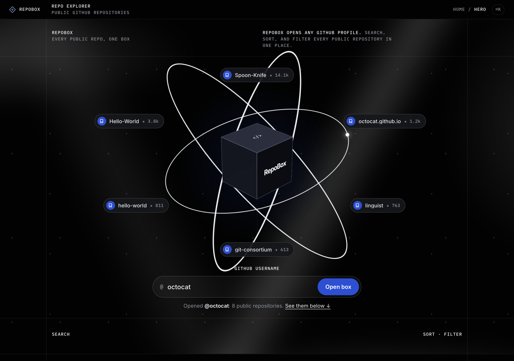
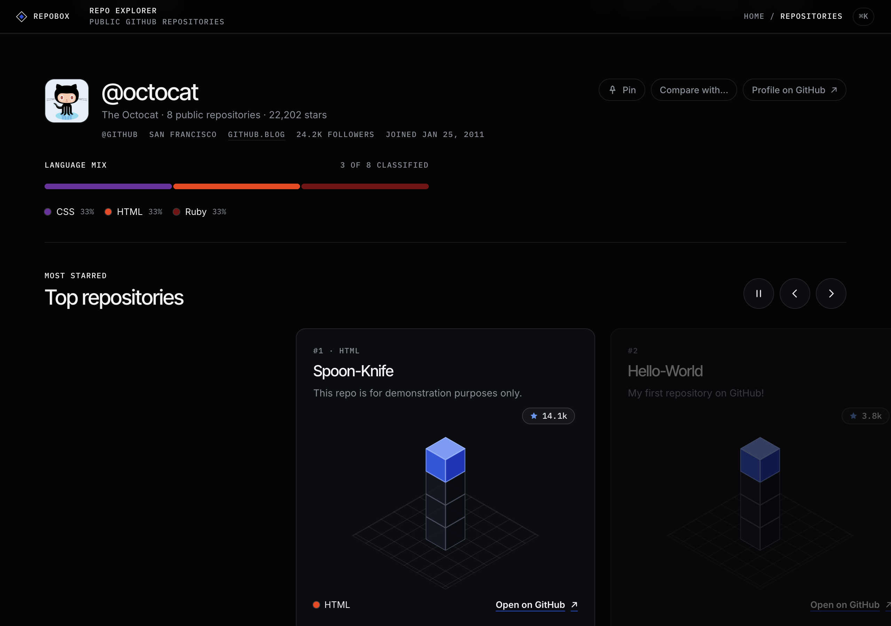
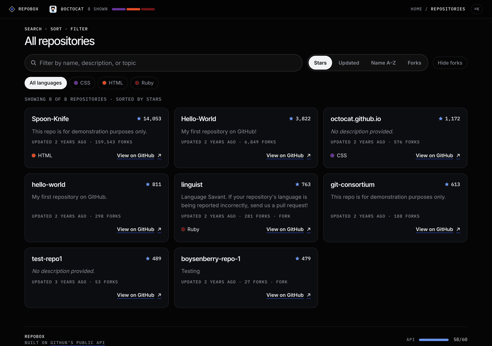
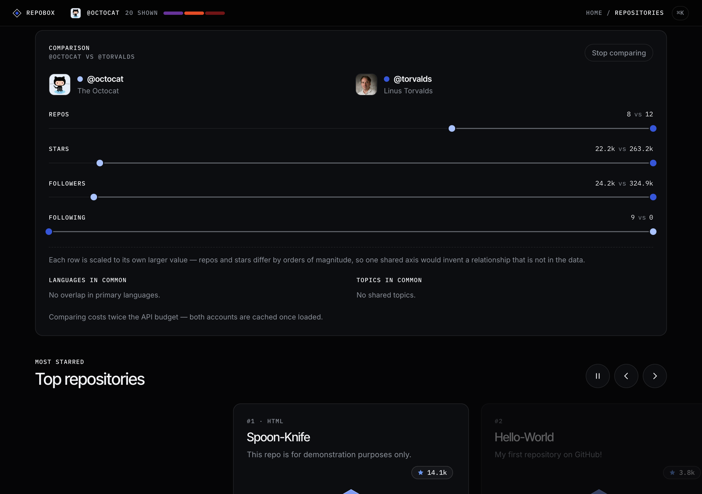
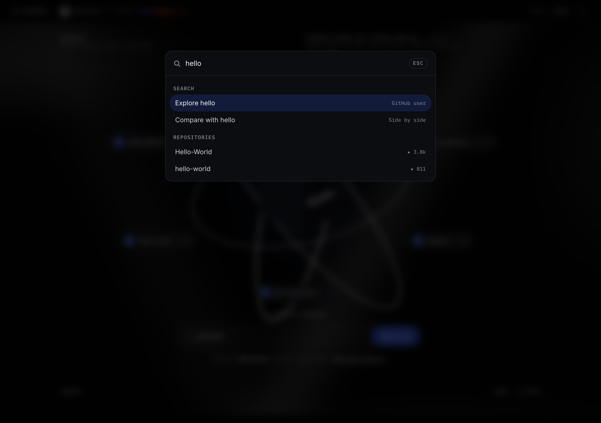
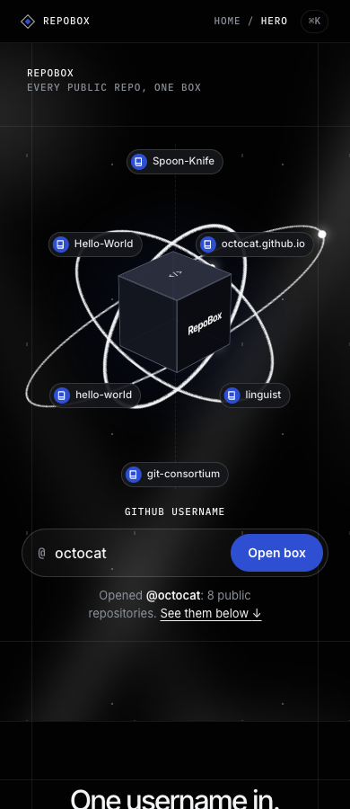

# RepoBox

A GitHub repository explorer on a black canvas. Enter a username and RepoBox opens its box: every
public repo — sortable, filterable, and weighed by the languages its owner actually builds in.

**Live demo: https://rishi-gandhi.github.io/SASE-SWEET-Take-Home-Project/**



---

## Running it

```bash
npm install
npm run dev          # http://localhost:5173
```

Other scripts:

```bash
npm run build        # production bundle into dist/
npm run preview      # serve the built bundle
npm test             # 119 unit + integration tests
npm run typecheck    # tsc, no emit
```

No API key, no `.env`, no backend. It talks straight to the public GitHub REST API.

**Stack:** React 19 + TypeScript + Vite, Tailwind CSS v4, Vitest + Testing Library. Three webfonts
(Inter Tight, Inter, IBM Plex Mono) from Google Fonts. No component library and no animation
library — the 3D is plain CSS. See [Why no component library](#why-no-component-library).

---

## What it does

- Look up any GitHub user and browse their public repositories
- Sort by stars, recency, name, or forks — and watch the cards physically travel to their new
  positions rather than teleport
- Filter by free text (name, description, **and** topics), by language, by topic, or by fork status
- A hero that *is* the account: a CSS 3D glass cube orbited by its six most-starred repositories
- The four most-starred as a swipeable carousel, each drawn as an isometric tower
- **Compare two accounts** side by side, with their repositories merged into one sortable grid
- A **language mix** bar and a **last-push activity strip** summarising the whole account
- A **command palette** (`⌘K`) for jumping to a user, opening a repo, finding a topic, pinning, or
  comparing
- **Pin** accounts you return to; recents are remembered automatically
- A **live API budget meter**, read from the response headers
- Loading, empty, no-match, and four distinct error states
- Keyboard shortcuts, `prefers-reduced-motion` honoured throughout, and a layout checked at 375,
  768, 1280 and 1440px
- Every view is a shareable URL



| All repositories | Two accounts compared |
|---|---|
|  |  |

| Command palette | On a phone |
|---|---|
|  |  |

---

## Design decisions

### Obsidian

The look is one idea taken all the way through: a pure-black canvas, 1px hairlines, small uppercase
mono labels pinned to the corners, and exactly one colour — a cobalt accent — reserved for "this is
the active thing". Depth comes from glow, borders and contrast, never from drop shadows. The visual
style is based on Zajno's Dribbble shot *Web Design for an Enterprise ERP Platform part 2*; only the
style is borrowed — no names, copy or assets. The single-file prototype I worked from is in
[`design-reference/`](design-reference/).

Every value is a custom property on `:root` — colours, the cube's faces, the type stacks, the
radius — and Tailwind reads them through `@theme`, so utilities and hand-written CSS can never
disagree. The 3D, the keyframes and the state-driven styling live in
[`src/obsidian.css`](src/obsidian.css), inside the `components` cascade layer so a utility can still
override them; layout stays in Tailwind utilities.

One lesson from the migration worth keeping: base rules (body type, the focus ring) live in
Tailwind's `base` layer. Left unlayered, they outranked every component rule regardless of
specificity — which silently broke the inline second line of a label, and would have drawn a second
focus ring inside the search field.

### Colour, contrast, and the trade I made on language colours

Text contrast, measured with the WCAG formula against the canvas (#020202): primary text 18.7:1,
secondary text 6.4:1 (6.0:1 on cards), white on the accent 6.6:1, and the accent as a focus ring
3.1:1 against the 3:1 minimum for non-text.

Language dots use **GitHub's own linguist colours**, so a dot means what it means on github.com.
They are keyed by language *name*, never by rank, which is what makes them stable: a language keeps
its colour when the list is filtered, when a comparison adds a second account, and from one account
to the next.

**The trade-off, owned:** the previous version of this app used three hues validated all-pairs for
colour-vision deficiency, and linguist colours were never designed as a set — HTML, Swift and C++
are all reds. So colour is never the only cue: every dot has its language name printed beside it, in
the cards, the chips, the carousel and the legend. The separation of roles survives everywhere
else: status colours (quota running low, errors) stay apart from the accent, the activity strip is a
single-hue ramp with monotonically rising lightness, and the two compared accounts are two
lightnesses of one hue — lightness being the one channel every form of colour-vision deficiency
preserves.

### The hero, and a loop that sleeps off screen

The hero is decoration with a job: its six orbit pills are the account's six most-starred
repositories (RepoBox's features before any search, skeletons while one loads). The stage runs a
13.4-second loop — lit glass cube, dim, pills pop in one by one, a highlight travels in ranking
order, every icon fills with the accent, pills leave, relight — with every timing in one config
object, `HERO_TIMELINE`.

A few details took more than one attempt:

- **It only runs while it can be seen.** One `IntersectionObserver` starts it at 15% visible and
  stops it once the hero has left entirely. The ratio is read explicitly: `isIntersecting` is true for
  *any* sliver, whatever threshold you ask for — the prototype relied on it and so never honoured its
  own 15%. Off screen, the CSS loops (smoke, rings, float) pause too, not just the timers.
- **Per-property transition delays.** The pills cascade in 330ms apart. With one `transition-delay`
  for everything, the travelling highlight and the pointer parallax on the sixth pill waited behind
  that cascade — up to 1.65s of lag. Each property now carries its own delay.
- **Speeding the rings up without a jump.** While a profile loads, the rings spin four times faster.
  Changing a running CSS animation's duration recomputes its progress against the new duration and
  snaps every ring to a different angle, so the rate is changed on the running animations through the
  Web Animations API instead: same angle, new speed.
- **Glass that actually fades.** Lit faces are gradients, and a gradient cannot interpolate with a
  flat colour — a `background` transition between them just snaps. Each face carries its lit gradient
  on a pseudo-element and fades it by opacity.
- **Pointer tilt without React.** The pointer's position is written to two CSS variables at most
  once per animation frame; the cube's tilt and the rings' and pills' parallax are all CSS reading
  them, so moving the mouse never re-renders anything. Mouse and pen only — on a phone, a drag is a
  scroll.

The stage is `aria-hidden`: every fact it shows is also in the list below it.

### The cube is real CSS 3D

No canvas, no WebGL, no three.js: six `<span>`s, each rotated to its side and pushed out from the
centre by half the edge length inside a `transform-style: preserve-3d` parent. The same component
draws the hero's glass cube, the three steps of "How it works" and every carousel tower.

Isometric cubes are tipped 35.26° forward and turned 45°. At that angle a cube's vertical edge
projects to cos(35.26°) ≈ 0.816 of its length, so cubes stacked 0.816 of a cube apart sit exactly on
top of one another. That one constant builds both the step stack and the towers.

### "How it works" is a pure function of scroll

The section is 280vh tall with a sticky panel: scrolling pulls three scattered cubes into a stack,
then opens it into an exploded view, with the step being described lit in the accent. The whole
choreography is `assemble(progress, size)` in [`src/lib/howItWorks.ts`](src/lib/howItWorks.ts) —
pure, and tested at its boundaries — and the component only writes its output to the DOM. Positions
go straight to style properties once per frame, so React re-renders only when the highlighted step
changes: three times in the whole section.

On a phone the prototype's scattered labels ran off the screen, so the sideways scatter narrows with
the stage width and each label wraps before the edge. Scroll is direct manipulation, so the section
still follows the page under reduced motion; it just adds no animation of its own.

### The carousel is native scrolling

"Top repositories" is a full-bleed `scroll-snap` track: dragging, swiping, trackpads and momentum
are the browser's, with no code at all. What is added on top is the idea of an active card (whichever
sits nearest the centre once scrolling settles), arrow buttons and keys, and auto-advance — which
runs only while 40% of the track is on screen and the tab is visible, holds for 8s after any touch
and while the pointer rests on it, never runs under reduced motion, and has a pause button, because
moving content needs a way to stop it (WCAG 2.2.2). It always shows the primary account's unfiltered
repositories, so filtering the list below never reshuffles it.

Each card's tower is one to four cubes, log-scaled against the account's most-starred repo. Star
counts are heavily skewed; on a linear scale everything but the leader would be a single cube. The
tower is a glance, and the exact count is printed beside it.

### No auth token, and an honest rate limit

The app calls GitHub unauthenticated: **60 requests/hour, per IP**. Shipping a token in a public
client-side app would leak it, and proxying through a backend was out of scope.

So instead of hiding the limit, the app puts it on screen. A meter in the footer reads
`x-ratelimit-remaining` and `x-ratelimit-limit` off **every** response — successes and failures
alike — and turns amber, then red, as the budget runs down.

Detecting an exhausted quota takes more than a status code: GitHub answers with `403`, the same
status it uses for genuinely forbidden requests. The header `x-ratelimit-remaining: 0` is what
actually distinguishes them. When the app sees that, it reads `x-ratelimit-reset` and says when the
quota refills.

Three things keep the app under the limit in normal use:

- **Client-side filtering.** All of a user's repos are fetched once, then every search, sort, and
  filter runs in memory. Typing costs zero requests. GitHub's search endpoint would be the
  alternative, and it is both slower and capped at 10 requests/minute anonymous.
- **An in-memory profile cache.** Revisiting a user (including via browser Back) costs nothing.
- **Local username validation.** A handle GitHub's own rules would reject never leaves the browser.

### Pagination has a deliberate ceiling

`/users/:login/repos` returns 100 per page. The app follows pages until a short page comes back, but
stops at **5 pages / 500 repos**. An uncapped loop over a 3,000-repo org would burn the entire hourly
budget on one search. It fetches sorted by `updated`, so anything dropped is the least recently
touched, and the UI says so rather than silently showing a partial list.

### Cancelling in-flight requests

Searching a new user aborts the previous request via `AbortController`. Without it, a slow response
for `tor` can land *after* a fast one for `torvalds` and overwrite it — the classic async race in
search UIs. Aborts are re-thrown untouched so the error handler can tell "cancelled" from "failed".

### The URL is the state

User, search text, language, topic, sort, and the fork toggle all live in the query string:

```
?u=simonw&q=cli&lang=Python&topic=datasette&sort=updated
```

A view is shareable and survives a refresh. Looking up a new user **pushes** a history entry, so
browser Back moves between users; changing a filter only **replaces** it, so Back isn't fifteen
presses of undoing your own typing. Using the query string rather than path segments also means it
works on GitHub Pages with no SPA redirect hack.

Where the page *scrolls* follows the same idea. Opening a shared link jumps straight to the results,
because a link to a view should open on that view. An explicit search glides down to them once the
account is ready. Back and Forward leave the scroll position alone.

### Animated re-sort (FLIP)

Changing the sort animates every card to its new position. The technique is FLIP — First, Last,
Invert, Play: React has already moved the cards by the time the layout effect runs, so each card's
new box is compared against the one recorded on the previous commit, the inverse translation is
applied, and then animated away. The browser only ever animates a `transform`, so a hundred cards
reorder on the compositor without a single layout pass.

Two details that are easy to get wrong:

- Positions are measured **relative to the container**, not the viewport. Viewport coordinates shift
  when the page scrolls between commits, which would make every card animate from the wrong place.
- A card whose **size** changed is skipped — translating it would only smear the resize.

### The language mix: a bar, three names

Part-to-whole, so it's a horizontal stacked bar rather than a donut: people are bad at comparing
angles and worse at arc lengths, and language names are long enough that a bar labels far better. It
doubles as a filter, which is why each segment is a real `<button>`.

It names the top three languages and folds the long tail into "Other": past three, segments get too
thin to click or label at phone width. It is always computed from the **unfiltered** repo set — a
fixed portrait of the account that filtering the list below never changes.

### The activity strip is scaled by quartiles, not linearly

Each cell is one month, shaded by how many repositories were **last pushed** in it. It is
deliberately not called a contribution graph: the repos endpoint returns one timestamp per repo, not
a commit history, and pretending otherwise would be a lie dressed as a chart.

Levels are quartiles of the non-zero months, the way GitHub's own contribution graph scales. A linear
scale against the maximum looked correct and was useless: one bulk month of 400 dependency bumps
dragged every other month down to the same bottom step and the chart stopped saying anything.

### Comparing two accounts

Add a second handle and both accounts' repositories merge into one grid, each card tagged with its
owner. Every pure function — filtering, sorting, topic and language options — works on the merged
set unchanged, because GitHub ids are unique site-wide so the merge needs no deduplication.

The comparison itself is **one dumbbell per metric, each scaled to its own larger value**. That is
the important decision: repos and stars differ by three orders of magnitude, and putting them on one
shared axis would invent a relationship that is not in the data. Per-row scales are small multiples —
every row is its own chart — and the exact figures are printed in each row header rather than beside
the marks, so two close values can never overlap.

**One invariant worth stating**, because I got it wrong first: starting a comparison must never
repaint a colour already on screen. In the first version I keyed language colours to the merged
pool, and C went from orange to grey when a 500-repo Python account outvoted it — the
recolour-on-filter anti-pattern. Colours are now keyed by language name, so the rule holds by
construction, and there is still a regression test for it.

Comparing costs twice the API budget, which is why the profile cache matters: flipping between two
accounts you have already loaded is free.

### The top bar

Sticky, 48px, three columns: the brand; a label that becomes the account's identity — avatar,
handle, visible count and a miniature language mix — once its header scrolls away; and a breadcrumb
that follows the section in view.

Both are `IntersectionObserver`s rather than scroll listeners: no per-frame work, no reading layout
on every scroll event. Two details from the condensed identity. The observed node is held in
**state, not a ref** — it only mounts once a profile loads, and an effect keyed on a ref object would
have run once against `null` and never again (that bug shipped in my first attempt, and the bar
simply never appeared). And the observer's root reaches far below the viewport: an instant jump from
past the header straight back to the top — Home, or "/" under reduced motion — goes from "above" to
"below" without ever intersecting a viewport-sized root, so no callback fires and the strip sticks.

The breadcrumb's root margin shrinks the viewport to a thin band 45% of the way down, so exactly one
section intersects at a time and the crumb changes as a section passes the reader's eye line.

### Staggered entrance

Cards fade up on a 35ms cascade, capped at eight so a 500-repo account does not spend seconds
drawing itself in. The delay is a CSS custom property set per card; under `prefers-reduced-motion`
both the duration *and the delay* are zeroed — zeroing only the duration would leave late cards
parked at `opacity: 0` for their full delay.

The entrance animation lives on the card and the FLIP transform lives on the grid item, so the two
transforms are on different elements and can never fight.

### Four error states, not one

"Something went wrong" is useless — a typo'd username, an exhausted quota, and a dropped connection
need three different actions. The API layer classifies failures into
`not-found | rate-limit | network | invalid-username | unknown`, and the UI writes real copy for each,
including whether a retry button even makes sense (it doesn't for a 404).

Each is said twice: in one line in the hero, right under the field where the search happened, and in
full where the results would have been. A handle that cannot exist also shakes the cube; a spent
quota or a dropped connection does not, because neither is the viewer's mistake.

Empty is split too: **"this account has no public repos"** and **"your filters matched nothing"** are
different problems, and only the second one gets a "Clear filters" button — under a sentence that
names the filters that did it (`No repositories match "zz" in Rust.`).

### Why no component library

The brief said component libraries were fine, but the same brief said the evaluation is about
technical decisions I can explain. Pulling in Mantine or shadcn would have meant a chunk of the UI
was code I hadn't written. The interactive pieces here are small enough to own: the sort is a
segmented control of real buttons with `aria-pressed`, the language filter is a row of toggle chips,
and the carousel is native scroll-snap. The same reasoning ruled out an animation library: the loop
is a handful of timeouts, the cube is CSS, and the scroll choreography is one pure function.

Tailwind v4 does the layout and exposes the design tokens. Every colour is a CSS custom property
defined once, so the utilities and the hand-written 3D CSS read the same values.

### Accessibility

A skip link; one consistent 2px accent focus ring, checked on every Tab stop; `aria-pressed` on every
toggle; polite live regions for the search lifecycle (the hint under the field, which also describes
the field) and for the result count; the decorative stage hidden from assistive technology, with
every fact it shows repeated in the list; link names that start with their visible label ("View on
GitHub: kernel"), so a voice-control user can say what they see; a keyboard-operable carousel with a
pause button; and a heading outline that runs h1 → h4 without gaps.

`prefers-reduced-motion` is honoured everywhere: the hero holds one still frame, the rings, float,
smoke and carousel stop, scrolling jumps instead of gliding, and the FLIP re-sort doesn't run.

The command palette is a listbox driven by the input rather than a set of focusable rows, so the
caret never leaves the field — `aria-activedescendant` is what tells a screen reader which option is
current. It traps scroll, closes on Escape, and restores focus to whatever opened it.

---

## Architecture

```
src/
  lib/
    github.ts        API client, pagination, error taxonomy
    repos.ts         filter + sort + topic/language options (pure)
    highlights.ts    top repositories and tower heights (pure)
    howItWorks.ts    the scroll choreography (pure)
    spectrum.ts      language distribution (pure)
    activity.ts      last-push histogram + quartile scaling (pure)
    compare.ts       two-account metrics, shared languages/topics (pure)
    languages.ts     GitHub linguist colours
    motion.ts        clamp, lerp, easing
    rateLimit.ts     quota store, written by the client, read via useSyncExternalStore
    format.ts        numbers, relative dates (Intl)
  hooks/
    useProfile.ts          fetch state machine, abort, cache
    useDeckState.ts        URL <-> state
    useHeroLoop.ts         the hero's timeline
    usePointerTilt.ts      pointer -> CSS variables, once per frame
    useSectionProgress.ts  scroll progress through a section
    useCarousel.ts         active slide, keys, auto-advance
    useOnScreen.ts         visibility with hysteresis
    useActiveSection.ts    the breadcrumb
    useScrolledPast.ts     the condensed identity
    useFlipReorder.ts      FLIP reorder animation
    useGlobalShortcuts.ts  ⌘K and "/"
    usePrefersReducedMotion.ts
    useRecentUsers.ts      recent handles (localStorage)
    usePinnedUsers.ts      pinned handles (localStorage)
    useRateLimit.ts        subscribes to the quota store
  components/     presentational; no fetching
  styles.css      tokens, @theme, base rules, utilities
  obsidian.css    the 3D, the motion, the designed components
  test/
```

The split that matters: **anything with interesting logic is a pure function in `lib/`.** Sorting,
filtering, the language breakdown, the activity histogram and the scroll choreography take data in
and return data out, so they're testable without rendering anything. Components receive props and
render. Hooks own the messy parts — network, URL, storage, animation.

State is `useState` + `useMemo`. No Redux, no React Query, no router. The one exception is the rate
limit, which lives in a module-level store because the API client writes to it and the client has no
business importing a hook — `useSyncExternalStore` is the supported way to read that without tearing.

## Tests

119 tests, run with `npm test`:

- **`repos.test.ts`** — every sort key, tie-breaking, search across name/description/topics, language
  and topic filters, combinations, and that sorting doesn't mutate its input
- **`highlights.test.ts`** — top repositories ranked exactly like the list's own sort, and tower
  heights on a log scale
- **`howItWorks.test.ts`** — scroll progress at the section's edges, the scatter → stack → exploded
  choreography, the 0.816 stacking, and the narrower spread on a phone
- **`spectrum.test.ts`** — ranking, the three-name cap, the "Other" fold, deterministic tie-breaks
- **`activity.test.ts`** — window boundaries, bucketing, and specifically that a 200-repo outlier
  month doesn't flatten the quiet months to one level
- **`compare.test.ts`** — per-metric scaling, no divide-by-zero on empty accounts, shared
  language/topic detection, and that merged ids stay unique
- **`rateLimit.test.ts`** — header parsing, malformed values, subscriber notification, and that an
  out-of-order response can't walk the remaining count back up
- **`github.test.ts`** — username validation, and that each failure maps to the right error kind:
  404, rate-limit-with-reset, a plain 403 that is *not* a rate limit, network failure, and an abort
  passing through untouched
- **`languages.test.ts`, `format.test.ts`, `motion.test.ts`** — linguist colours and their fallback,
  SI-style counts ("2.4k"), easing and interpolation
- **`App.test.tsx`** — the real flows against a stubbed API: search → render, the hint narrating each
  stage, filter → count, language chips and the language bar, the four-way sort, Hide forks, topic
  chips and their removal, the carousel (order, links, buttons, arrow keys), the command palette
  (open, run, find a topic, Escape), the budget meter, URL round-tripping, shared links, each error
  state, empty submits, comparing two accounts, a failed second account degrading without taking the
  first down, pinning surviving a remount, the stagger delays, and that starting a comparison does
  not repaint existing language colours

jsdom has no `IntersectionObserver`, and every hook that needs one treats that as "nothing is on
screen" — so in tests the hero holds its first frame and nothing animates. `scrollIntoView` and
`matchMedia` are stubbed in `src/test/setup.ts`. The visual behaviour — the loop's timeline, the
tilt, the scroll choreography, reduced motion, no sideways scroll from 375px to 1440px, a focus ring
on every Tab stop — was checked in real Chrome against stubbed GitHub responses.

## Trade-offs, and what I'd do next

- **The 500-repo ceiling.** Fine for people, visible for large orgs. Real fix is windowed infinite
  scroll, which is more machinery than this exercise warranted.
- **Total stars is a lower bound** for accounts past the ceiling, since it sums only what was loaded.
- **Linguist colours aren't a validated set.** Names are always printed, but two reds can sit side
  by side in the language bar.
- **"How it works" costs scroll.** It sits between the search and the results; an explicit search
  glides past it and shared links jump straight over it, but a reader scrolling by hand pays for it.
- **Neighbouring carousel cards are dimmed to 38%**, under text-contrast minimums, as a deliberate
  preview state; a focused card is always drawn at full strength.
- **Comparing doubles the request cost**, which against a 60/hour budget is the single most
  expensive thing you can do in this app. The cache softens it; a token would solve it.
- **With more time:** a tiny serverless proxy holding a token (5,000 requests/hour instead of 60),
  the repo list virtualised, and a language breakdown weighted by *bytes* via
  `/repos/:owner/:repo/languages` rather than by primary-language repo count — more accurate, but one
  extra request per repo, which the anonymous rate limit rules out entirely.

---

Built with the [GitHub REST API](https://docs.github.com/en/rest/repos/repos).
